# Hi, I'm Marshid 👋

**Fullstack Developer**

I build complete web applications — from database schema and REST API to polished, responsive React frontends.

[LinkedIn](https://www.linkedin.com/in/marshidp/) · [Portfolio](https://marshid-portfolio.vercel.app/) · [Telegram](https://t.me/YOUR_TELEGRAM)

---

## 💻 About Me

- 🌱 Fullstack developer focused on **React + TypeScript** on the front and **Node.js/Express** and **Python/FastAPI** on the back
- 🔐 Comfortable with real-world concerns: **JWT auth**, password hashing, input validation, and error handling
- 🗄️ Work across both **SQL** (PostgreSQL, SQLAlchemy) and **NoSQL** (MongoDB) data layers
- ⚡ Build real-time features with **Socket.io**
- 🐳 Containerize everything with **Docker** for consistent local and deployed environments
- 💬 Ask me about REST API design, React component architecture, or auth flows

---

### 💻 Technologies

---

### 🛠 Tools

---

### 🤝 Where to find me

---

### 📊 Statistics & Languages

---

### 🚀 Featured Projects

| Project | What it is | Stack |
| --- | --- | --- |
| [`fullstack-portfolio`](https://github.com/marshu123/fullstack-portfolio) | Monorepo of 4 production-style apps: e-commerce, social dashboard, chat, task manager | React, TypeScript, Express, FastAPI, MongoDB, PostgreSQL |
| [`portfolio-website`](https://github.com/marshu123/fullstack-portfolio/tree/main/portfolio-website) | Interactive personal portfolio site | Next.js 14, Tailwind CSS |
| [`task-manager`](https://github.com/marshu123/task-manager) | Standalone task management app with JWT auth | FastAPI, SQLAlchemy, React |

---

  Made with ❤️ by Marshid

